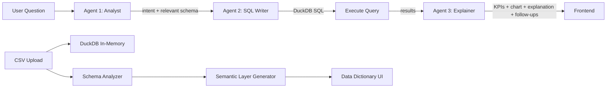

# DataPulse — Talk to Your Data, Get Answers You Trust

DataPulse is a self-service data intelligence tool that lets non-technical users ask natural language questions about any CSV dataset and get clear, trustworthy answers with visualizations. No SQL, no formulas, no training required.

**Built for:** NatWest Group "Code for Purpose – India Hackathon" · Talk to Data track

---

## Overview

Business analysts and team leads need quick data insights but lack SQL skills or access to BI tools. DataPulse bridges this gap: upload a CSV, ask questions in plain English, and get instant answers with charts, KPIs, and explanations — all running locally with no data leaving the device.

The system uses a **two-agent query pipeline** (inspired by Azure SQL's collaborating agents pattern) paired with a **Snowflake-format semantic layer** to ensure consistent, auditable metric definitions across all queries.

---

## Features

- **Natural language querying** — Ask questions in plain English, get SQL-powered answers
- **Three-agent pipeline** — Agent 1 (Analyst) selects relevant schema, Agent 2 (SQL Writer) generates focused SQL, Agent 3 (Explainer) produces explanations with KPIs and charts
- **Deterministic driver analysis** — "Why did X change?" triggers a pure-SQL engine that computes exact contribution percentages per dimension value — no hallucination, verifiable numbers
- **SQL sanitizer** — Every LLM-generated query is validated for safety (SELECT/WITH only, no DROP/DELETE/UPDATE) before execution — security matters in a banking context
- **Snowflake-format semantic layer** — Auto-generated data dictionary with metrics (SQL expressions + synonyms), dimensions (sample values), and time dimensions (granularity detection)
- **Auto-dashboard** — Instant visual overview after upload: KPI cards, time trend, dimension breakdown — no LLM calls needed
- **Visual-first answers** — KPI cards with counter animation → driver waterfall chart → hero chart → insight line → explanation → follow-up suggestions
- **Disambiguation** — When questions are ambiguous, the system asks clarifying questions with clickable options instead of guessing
- **4 analysis modes** — What Changed, Compare, Breakdown, Summary (plus Auto)
- **Follow-up suggestions** — AI-generated next questions after each answer, specific to the current result
- **Query caching** — Repeated questions return cached results instantly (10-min expiry)
- **Data lineage** — Transparency panel shows intent, confidence, SQL used, metrics with expressions, and data coverage %
- **Copy as markdown** — One-click export of any answer
- **Privacy** — All data processed locally via DuckDB. Nothing leaves your device.
- **3 banking sample datasets** — SME Lending, Customer Support, Digital Banking (with embedded stories/anomalies for compelling demos)

---

## Quick Start

### Prerequisites
- Python 3.10+
- Node.js 18+
- Free Groq API key from https://console.groq.com/keys

### One-Command Setup

```bash
# Linux/Mac
chmod +x scripts/start.sh && ./scripts/start.sh

# Windows
.\scripts\start.bat
```

### Manual Setup

```bash
# 1. Clone and enter the project
cd datapulse

# 2. Create .env with your API key
cp .env.example .env
# Edit .env and add your GROQ_API_KEY

# 3. Backend
python -m venv venv
source venv/bin/activate       # Windows: venv\Scripts\activate
pip install -r requirements.txt

cd src/backend
uvicorn main:app --port 8000 &

# 4. Frontend
cd ../../src/frontend
npm install
npm run dev

# 5. Open http://localhost:3000
```

---

## Tech Stack

| Technology | Why |
|-----------|-----|
| **DuckDB** | Zero-config in-memory SQL engine. No database setup. Handles GROUP BY/window functions on CSV data faster than SQLite. |
| **Groq (Llama 3.1 8B Instant)** | Fast, free-tier LLM for NL-to-SQL and explanations. 500K tokens/day on free tier. |
| **FastAPI** | Async Python framework with auto-generated API docs at `/docs`. |
| **React 18 + Vite** | Component-based frontend with instant hot reload. Lean — no Redux, no heavy libraries. |
| **Recharts** | Composable chart library built on React. Supports all chart types we need with built-in animations. |

---

## Usage Examples

### 1. What Changed
> "Why did disbursed amount drop in South region?"

Returns: KPI cards showing South's metrics → waterfall chart of drivers → explanation identifying tighter approval criteria as the root cause → follow-up suggestions

### 2. Compare
> "Compare North vs South approvals"

Returns: KPI cards for each region → grouped bar chart → insight line highlighting the difference → suggestions for deeper analysis

### 3. Breakdown
> "What makes up total tickets by channel?"

Returns: KPI cards → donut chart showing channel proportions → explanation noting App channel growth and Branch decline

### 4. Summary
> "Give me a weekly summary"

Returns: Row of KPI cards with sparklines → trend overview → anomaly callouts → related follow-up questions

---

## Architecture

### Design Decisions

Our query pipeline uses a **two-agent pattern** inspired by [Azure SQL's collaborating agents approach](https://devblogs.microsoft.com/azure-sql/a-story-of-collaborating-agents-chatting-with-your-database-the-right-way/):

- **Agent 1 (Analyst)** — Receives the full semantic layer, classifies intent, selects relevant metrics/dimensions, creates a query plan
- **Agent 2 (SQL Writer)** — Receives ONLY the relevant columns' schema + plan, generates focused DuckDB SQL
- **Agent 3 (Explainer)** — Receives results, produces explanation + KPIs + chart config + follow-up suggestions

This separation improves SQL quality because Agent 2 sees only relevant context, dramatically reducing column hallucination.

Our semantic layer format mirrors [Snowflake Cortex Analyst's semantic model specification](https://docs.snowflake.com/en/user-guide/snowflake-cortex/cortex-analyst/semantic-model-spec):
- **Metrics** with SQL expressions (`expr`), synonyms, and data types
- **Dimensions** with sample values for accurate WHERE clauses
- **Time dimensions** with granularity detection (daily/weekly/monthly)

**Deterministic driver analysis** — When intent is "change", we run a pure-SQL engine that computes exact contribution percentages per dimension value across all periods. The LLM then narrates these real numbers rather than guessing. This eliminates hallucination for the most trust-sensitive query type.

**SQL safety layer** — Every LLM-generated SQL query passes through a sanitizer that blocks DROP, DELETE, TRUNCATE, INSERT, UPDATE, and comment injection before execution. The frontend shows a green "Query validated" badge in the transparency panel.

### Data Flow



### Project Structure

```
datapulse/
  src/
    backend/
      main.py                    # FastAPI app setup, CORS, routes
      config.py                  # Settings, constants
      routes/
        upload.py                # POST /api/upload, GET /api/samples
        query.py                 # POST /api/ask (three-agent pipeline)
        semantic.py              # GET/PUT /api/semantic-layer
      services/
        query_pipeline.py        # Three-agent pipeline: analyst -> sql_writer -> explainer
        driver_analysis.py       # Deterministic driver analysis — pure SQL, no LLM
        schema_analyzer.py       # CSV type detection, stats, date handling
        semantic_engine.py       # Snowflake-format semantic layer generation
        chart_recommender.py     # Chart type validation and repair
      utils/
        duckdb_manager.py        # Session management
        cache.py                 # NL->SQL result cache (10-min expiry)
        gemini_client.py         # Groq/LLM API wrapper with retry
        sql_sanitizer.py         # SQL safety validation before execution
      models/
        schemas.py               # Pydantic request/response models
    frontend/
      src/
        App.jsx                  # Main app with landing + workspace layout
        components/
          ChatInterface.jsx      # Chat with visual-first answer layout
          SemanticLayer.jsx      # Data dictionary editor
          DataPreview.jsx        # Schema + stats + sample rows
          charts/
            ChartRenderer.jsx    # Master chart selector
            KPICard.jsx          # Animated KPI with counter roll-up
            KPIRow.jsx           # Flex row of KPI cards
            AnimatedBar.jsx      # Sequential bar reveal
            AnimatedLine.jsx     # Line/area with draw effect
            AnimatedDonut.jsx    # Donut with segment unfold
            WaterfallChart.jsx   # Custom SVG waterfall cascade
            Sparkline.jsx        # Mini SVG sparkline with draw animation
  tests/
    test_backend.py              # 36 tests covering all modules
  scripts/
    start.sh                     # Linux/Mac one-command setup
    start.bat                    # Windows one-command setup
    generate_samples.py          # Banking sample dataset generator
  assets/samples/                # Pre-generated banking datasets
```

---

## Limitations

- **Single table only** — Currently supports one CSV per session (no joins)
- **No persistent storage** — Sessions are in-memory; data is lost on server restart
- **LLM rate limits** — Groq free tier has daily limits; heavy usage may hit throttling
- **No authentication** — Not designed for multi-user production deployment
- **English only** — NL processing optimized for English questions

---

## Future Improvements

- Multi-table support with automatic join detection
- Persistent session storage with SQLite
- Streaming LLM responses for faster perceived latency
- Export to PDF/PowerPoint for executive reports
- Voice input for accessibility
- User feedback loop to improve query accuracy over time

---

## License

Apache 2.0 — see [LICENSE](LICENSE)
