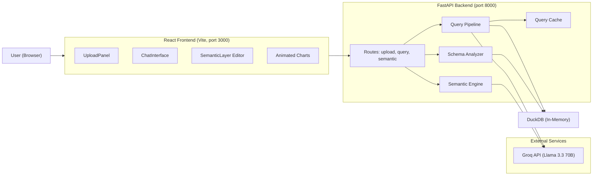
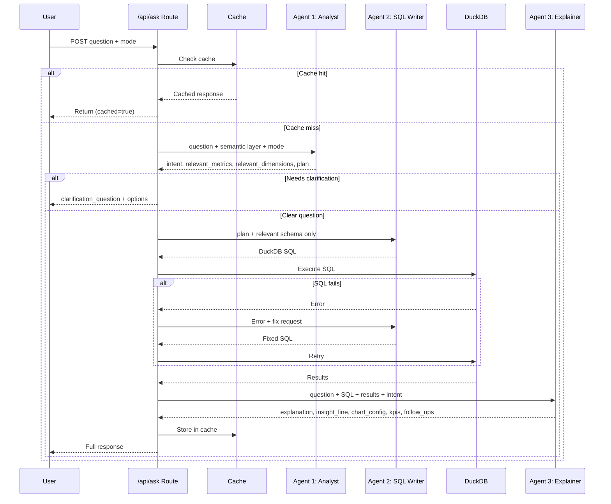
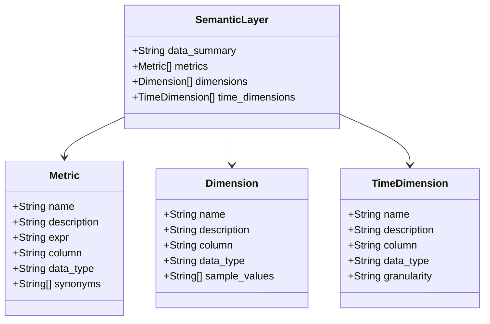

# DataPulse Architecture

## System Overview

## Query Pipeline (Two-Agent Pattern)

Inspired by [Azure SQL's Collaborating Agents](https://devblogs.microsoft.com/azure-sql/a-story-of-collaborating-agents-chatting-with-your-database-the-right-way/).

## Semantic Layer Structure

Mirrors [Snowflake Cortex Analyst's Semantic Model](https://docs.snowflake.com/en/user-guide/snowflake-cortex/cortex-analyst/semantic-model-spec).

## Visual-First Answer Hierarchy

Every assistant answer follows this layout (top to bottom):

1. **KPI Cards Row** — 2-4 animated counter cards with deltas
2. **Hero Chart** — Primary visualization (bar/line/donut/waterfall)
3. **Insight Line** — One bold sentence summarizing the key finding
4. **Explanation** — 3-5 sentences of plain-English context
5. **Data Table** — Collapsed by default, expandable
6. **Follow-up Chips** — 2-3 suggested next questions
7. **Transparency** — Collapsed "How was this answered?" with SQL, confidence, coverage

## Key Design Decisions

| Decision | Rationale |
|----------|-----------|
| DuckDB over SQLite | Analytical queries (GROUP BY, window functions) run faster |
| Groq over OpenAI | Free tier with generous rate limits, fast inference |
| System fonts over Google Fonts | Instant load, native feel, no external requests |
| Light theme | Professional appearance, matches NatWest design language |
| Two-agent split | Agent 2 sees only relevant columns, reducing hallucination |
| Snowflake-format semantic layer | Matches judges' internal tooling (Cortex Analyst) |
| In-memory cache | Simple, no external dependency, good enough for demo |
| Recharts | React-native charts with built-in animation support |
