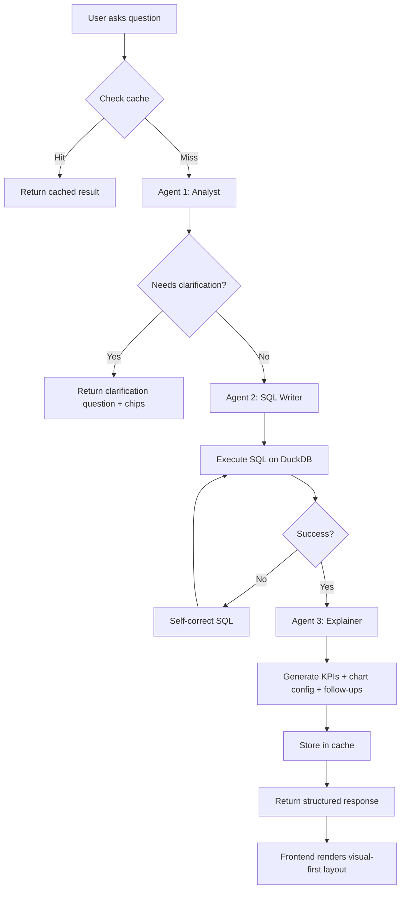
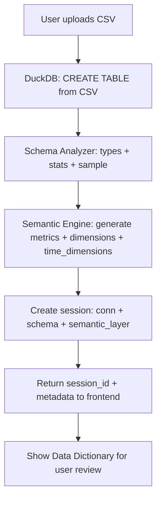
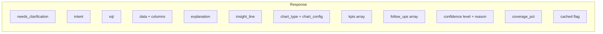

# DataPulse Query Pipeline — Data Flow

## End-to-End Query Flow

```mermaid
flowchart TD
    A[User asks question] --> B{Check cache}
    B -->|Hit| C[Return cached result]
    B -->|Miss| D[Agent 1: Analyst]
    
    D --> E{Needs clarification?}
    E -->|Yes| F[Return clarification question + chips]
    E -->|No| G[Agent 2: SQL Writer]
    
    G --> H[Execute SQL on DuckDB]
    H --> I{Success?}
    I -->|No| J[Self-correct SQL]
    J --> H
    I -->|Yes| K[Agent 3: Explainer]
    
    K --> L[Generate KPIs + chart config + follow-ups]
    L --> M[Store in cache]
    M --> N[Return structured response]
    N --> O[Frontend renders visual-first layout]
```

## Upload Flow

```mermaid
flowchart TD
    A[User uploads CSV] --> B[DuckDB: CREATE TABLE from CSV]
    B --> C[Schema Analyzer: types + stats + sample]
    C --> D[Semantic Engine: generate metrics + dimensions + time_dimensions]
    D --> E[Create session: conn + schema + semantic_layer]
    E --> F[Return session_id + metadata to frontend]
    F --> G[Show Data Dictionary for user review]
```

## Response Structure

```mermaid
flowchart LR
    subgraph Response
        A[needs_clarification]
        B[intent]
        C[sql]
        D[data + columns]
        E[explanation]
        F[insight_line]
        G[chart_type + chart_config]
        H[kpis array]
        I[follow_ups array]
        J[confidence level + reason]
        K[coverage_pct]
        L[cached flag]
    end
```
